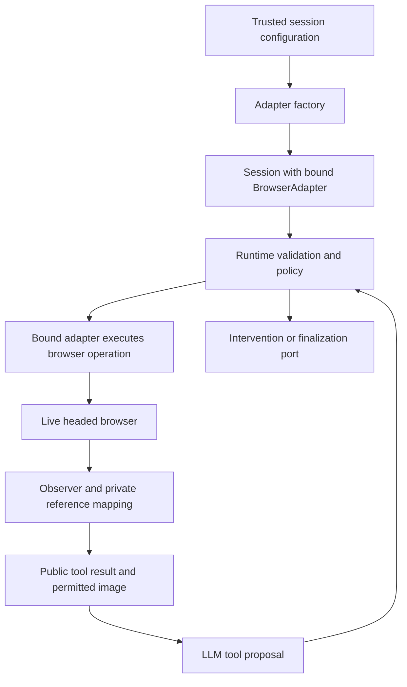

# Computer-use architecture: agreed decisions and implementation assumptions

Status: decision reference for planning; no implementation exists yet.
Date: 2026-10-05.
Source: the design conversation and the supplied `Assignment A — Computer-Use Automation System.pdf`.

Later decision: [runtime orchestration plan](../plans/2026-10-05-runtime-orchestration-implementation.md) supersedes this document's persistent-session and provider-neutral runtime assumptions for the first build. This document remains authoritative for the agreed individual tool contracts and browser adapter behavior. One task invocation now owns one browser adapter, with no session registry or session ID.

## 1. Scope and decision status

Build the computer-use foundation for a real, goal-driven discovery loop against a web application. The model observes UI state and proposes typed actions. The runtime validates and dispatches those actions through a browser adapter, then returns observations and structured results.

This document distinguishes **agreed requirements** from **proposed implementation choices**. It does not claim that the remaining assignment layers have been designed.

### Agreed

- Hybrid perception and targeting: semantic controls when usable, screenshots and coordinates when necessary.
- A browser adapter implemented with Playwright; Chromium initially.
- Runtime chooses and binds the adapter at session initialization. Tool calls use the bound adapter; the LLM does not select adapters.
- Browser-only implementation now, with an adapter contract that admits future desktop implementations and explicit unsupported capabilities.
- One visible, headed browser window for the local demonstration, separate from the application interface.
- A later application interface accepts a goal and URL, shows progress/results, and manages artifacts. Embedding a browser stream is not required.
- Twelve typed tools, specified below. No unrestricted model-generated JavaScript or arbitrary selector execution.
- Runtime owns policy, session ownership, reference validation, configured waits/timeouts, and dialog decisions.
- Both the LLM and runtime can request intervention. Post-request takeover/resume design is deferred.
- Successful discovery finalization ultimately requires a validated, stored artifact. `finish_task` is provisional until that artifact contract is designed.
- Do not launch browser previews or assume anything is running on port 3000 during planning. Nothing is running as part of this work.

### Proposed implementation choices, not previously selected by the user

- TypeScript on a supported Node.js LTS release, npm, Zod for runtime schemas/JSON Schema generation, Vitest for unit and browser-adapter integration tests.
- A single process with modules; no queues, distributed workers, database, or tenant infrastructure for this layer.
- Configured finite limits, with proposed development defaults: 1280×800 viewport, device scale factor 1; navigation 15,000 ms, action 5,000 ms, observation 5,000 ms, condition wait 5,000 ms, condition poll 100 ms; 100 model tool calls and 120,000 ms per discovery run; positive scroll distance at most 2 viewport lengths.
- Default navigation readiness: document content loaded, followed by a bounded observation capture. This does not imply business readiness or a fully idle application. Browser background traffic must not make readiness unbounded.
- One active page per session for the first slice. Unexpected popups/new tabs are reported as unsupported; never silently change the active surface.
- The concrete LLM provider/model, application-interface framework, deployment, and artifact schema are not selected. Provide ports and tests without choosing those on the user's behalf.

## 2. Responsibility boundaries

| Component | Owns | Does not own |
| --- | --- | --- |
| Model | Goal interpretation; proposals using observed state | Browser objects, policy authority, hidden application state |
| Tool registry | Public input/output schemas; model-facing descriptions | Session selection by model arguments |
| Runtime | Session binding, schema validation, policy, limits, serialization, intervention/finalization ports | Browser-specific selectors or native desktop APIs |
| Observer service | Public observations, image delivery metadata, observation-scoped control references | UI mutations, durable artifact locators |
| Observation store | Per-session maps, validity, opaque adapter bindings | Cross-session reference reuse |
| Browser adapter | UI capture, target resolution, browser mechanics, primitive checks/reads, browser events | Deciding whether business actions are authorized |
| Policy service | Allow/deny/escalate and data exposure rules, including dialog policy | Unrestricted LLM overrides |
| Evidence service | Redacted execution records and permitted failure evidence | Raw sensitive payload logging or artifact creation |

`request_human` and `finish_task` are runtime tools; they are not methods that a browser adapter must implement.

## 3. Session and dispatch architecture

1. A trusted caller supplies a goal, entry URL, and runtime configuration.
2. The runtime validates configuration and creates a session, private observation store, execution gate, and evidence sink.
3. An adapter factory creates `BrowserAdapter`, attaches policy/event hooks, and binds it to that session exactly once.
4. Initial navigation uses the same policy and execution path as `navigate`; it is not an unguarded setup shortcut.
5. Model tool calls carry only public arguments. Session identity comes from the trusted invocation context.
6. The runtime validates schema, ownership, budget, references, capability and policy; then calls the bound adapter.
7. Mutations are serialized. A failure/timeout does not automatically permit a new operation while an old browser operation may still be running.
8. The runtime captures fresh UI state when possible and returns structured metadata plus image content to the model.
9. Browser lifecycle cleanup is explicit. An intervention request must not accidentally close the live browser.

The adapter must advertise capabilities. Calling an unsupported operation returns a structured result rather than choosing a different adapter or silently changing targeting semantics.



## 4. Observations and reference mapping

`observe_ui` has three modes: `screenshot`, `controls`, `both`. The default guidance to the model is `both`; schema requires an explicit mode. It is read-only and may be called repeatedly within runtime budgets. Mutating tools also obtain a fresh observation so the model need not issue a redundant read after every action.

```typescript
type ControlTarget = { kind: "control"; control_ref: string };
type PointTarget = { kind: "point"; x: number; y: number };
type Target = ControlTarget | PointTarget;

type Control = {
  ref: string;
  parent_ref?: string;
  role: string;
  name: string;
  state: {
    enabled?: boolean;
    focused?: boolean;
    checked?: boolean;
    expanded?: boolean;
  };
  value?: string;
};

type ObservationResult =
  | {
      status: "ok";
      observation_id: string;
      captured_at: string;
      surface: { id: string; kind: "browser" | "desktop"; title: string; url?: string };
      screenshot:
        | { status: "available"; image_ref: string; width: number; height: number }
        | { status: "unavailable" | "not_requested" };
      controls:
        | { status: "available"; items: Control[] }
        | { status: "unavailable" | "not_requested" };
    }
  | {
      status: "error";
      code: "SURFACE_UNAVAILABLE" | "CAPTURE_FAILED";
      message: string;
      retryable: boolean;
    };
```

- Missing state properties mean unknown, not false. Missing semantic information does not make a valid screenshot unusable.
- An empty available control list differs from unavailable controls.
- Static text/result nodes must be representable so `check_ui` and `extract_data` can address them; `Control` is the retained public name, not a restriction to clickable elements.
- Images travel as actual provider-supported image content alongside JSON metadata. `image_ref` alone is not a visual observation.
- Coordinates are relative to the exact returned screenshot. Browser adapter records dimensions, scale, and surface mapping privately; never mix screen, page, iframe, device and viewport coordinates.
- Capture screenshot and semantic information close together and retry a bounded capture if navigation/state changes make the pair inconsistent. Do not claim atomic capture of a continuously changing UI.
- Read rendered UI/accessibility information, not application source files, API responses, storage, database rows, or hidden business state.

### Mapping example

```text
Session A
  obs_017: valid, surface=tab_1, document_generation=3
    c1 -> adapter binding for textbox "Member ID"
    c2 -> adapter binding for button "Search"
```

The model gets `c1`/`c2` plus public properties. Only the browser adapter holds Playwright locators/element bindings. The runtime's observation store holds opaque bindings associated with the references.

`obs_017 + c2` retrieves a targeting mechanism, not proof of current identity. Revalidate the actual target. Role/name alone must not select the first of several matches. Preserve observed scope/frame and reject ambiguous resolution.

### Validity rules

Agreed minimum: replacing a document invalidates observations of the previous document for subsequent actions. Historical evidence may remain. A new observation may reuse names such as `c1`; references are only meaningful with their observation and session.

Proposed conservative implementation:

- Store document/frame generation, surface identity, viewport mapping and a validity reason privately.
- Publicly publishing a new observation supersedes previous observations for new tool calls. Bound operations already in progress, such as `wait_for`, retain their validated target until completion or generation change.
- Starting an action reserves its input observation for that action; new competing calls cannot reuse it.
- Invalidate on document replacement, relevant iframe replacement, surface loss, and acknowledged human-side mutations. Re-observe after scroll/resize before coordinate reuse.
- Before point input, check dimensions and detectable layout changes; reject and capture again when changed. This reduces but cannot eliminate the time-of-check/time-of-use race.
- Observation capture failure after a mutation must not restore the old observation's validity.
- `wait_for` can follow same-document value/state changes using its retained scoped locator; document replacement returns `invalidated`.

Do not equate observer references, provider-supplied element references, or live Playwright objects with durable replay locators.

## 5. Typed tool contracts

All schemas reject unknown fields, non-finite numbers, invalid enums and malformed targets. Runtime configuration and session IDs are not LLM-controlled arguments. Shared error metadata is a proposed additive consistency improvement: `code`, `reason`, and optional structured `blocker`/dialog events. Preserve the following tool-specific status meanings.

### 5.1 `observe_ui`

- Input: `{ mode: "screenshot" | "controls" | "both" }`.
- Output: `ObservationResult`, with actual image bytes provided through the model transport.
- No UI actions. Repeated reads are bounded by call/time/no-progress limits.

### 5.2 `navigate`

- Input: `{ url: string }`, absolute HTTP(S) URL supplied by the task or observed during the run.
- Existing active tab and browser context; preserve authentication/cookies. No tab creation/switching.
- Runtime validates destination and redirects. URL permission checks must apply to action-triggered navigation too, not just this tool.
- Readiness and timeout are configured by runtime, not model arguments.
- Return `{ status: "completed" | "blocked" | "failed" | "uncertain", requested_url, final_url?, reason?, observation, blocker?, dialog_events? }`.
- Completed means navigation and observation succeeded. Reaching login or an application error page can still be completed navigation.
- Timeout may leave the browser at the destination; return current evidence and do not blindly repeat navigation.

### 5.3 `click`

- Input: `{ observation_id: string, target: Target }`.
- One ordinary primary-button click. Double-click/right-click are outside this contract.
- Resolve and validate control identity or screenshot coordinate; no forced click through overlays.
- Return `{ status: "completed" | "blocked" | "failed" | "uncertain", reason?, observation, blocker?, dialog_events? }`.
- Completed means click execution, not a verified business outcome. Return uncertainty when dispatch/outcome cannot be established; never repeat a consequential click automatically.

### 5.4 `type_text`

- Input: `{ observation_id: string, target: Target, text: string, mode: "replace" | "append" }`.
- Establish focus on the intended editable target. Replace its entire content or append at its end, independent of the previous caret position.
- Point targeting explicitly includes a policy-checked click/focus attempt followed by editing only if editable focus can be established. Do not accidentally type into another field or use select-all on the page body.
- No intentional Enter, submission, or focus advance. Autocomplete/autosave side effects belong to the app and must be observed.
- Return `{ status: "completed" | "blocked" | "failed" | "uncertain", verification: "matched" | "mismatched" | "unavailable", reason?, observation, blocker?, dialog_events? }`.
- Completed requires verified resulting text. Known mismatch is failed; dispatched but unreadable result is uncertain. No blind append retries.

### 5.5 `press_key`

- Input: `{ observation_id: string, target?: ControlTarget, keys: string[] }`.
- Target omitted: current focus in the active surface. Target present: establish focus without clicking/activation, then send the key.
- Point targets are explicitly excluded by the later agreed refinement. Use separate `click(point)` then `press_key` calls with a fresh observation.
- One key or simultaneous modifier combination per call, not a sequence. Validate a defined key vocabulary. Proposed initial modifiers: Control, Meta, Alt, Shift; one final named key or printable key.
- Enter and shortcuts can trigger risky actions; policy considers context. All modifiers must be released even on error.
- Return action status, reason, observation and optional dialog evidence. Completed means input dispatched; effect is observed separately.

### 5.6 `scroll`

- Input: `{ observation_id: string, target?: Target, direction: "up" | "down" | "left" | "right", distance: number }`.
- No target means main viewport; control target means that scrollable region; point target means a uniquely resolved scrollable region under that point.
- Distance is a positive fraction of the selected region's visible height/width, not document size. Runtime bounds it.
- No click or intentional focus change. Do not silently scroll a parent when the selected region is at its boundary.
- Return `{ status: "completed" | "blocked" | "failed" | "uncertain", movement: "moved" | "no_movement" | "unknown", reason?, observation, blocker?, dialog_events? }`.
- At a boundary, known no movement is valid completion. Unknown movement is uncertain. Observe after settling; coordinate references must be refreshed.

### 5.7 `select_option`

- Input: `{ observation_id: string, target: ControlTarget, option: { label: string } }`.
- Exact, unique observed option label; single-selection supported controls only. Reject missing/disabled/ambiguous options.
- No separate model-issued opening click is necessary when the adapter supports direct selection. Native HTML select is the first supported browser control.
- Custom widgets without a supported selection operation return unsupported. The model may use explicit click/observe/keyboard steps instead; do not secretly execute a visual mini-agent.
- Return status, `verification: "matched" | "mismatched" | "unavailable"`, optional selected label, reason, observation and dialog evidence.
- Completed requires verified selection. No extra Enter/submit. A change handler may still cause app side effects.

### 5.8 Shared condition contract

```typescript
type Condition =
  | { kind: "visible" }
  | { kind: "hidden" }
  | { kind: "enabled" }
  | { kind: "text_equals"; expected: string }
  | { kind: "value_equals"; expected: string };
type ConditionInput = {
  observation_id: string;
  target: ControlTarget;
  condition: Condition;
};
```

Visibility is adapter-defined rendered visibility and should not be presented as proof that a control receives pointer events. A missing target satisfies hidden, fails visible, and produces unknown for enabled/text/value. An ambiguous target produces unknown. Invalid observation produces unknown, not evidence of absence. Text/value equality uses an explicit consistent comparison rule; proposed default is exact text with line endings normalized, no fuzzy matching or automatic case folding.

### 5.9 `wait_for`

- Input: `ConditionInput`. Only already-observed control references; no points, arbitrary visual predicates, or model-provided timeout.
- Runtime repeatedly evaluates the condition without model calls or UI mutation.
- Return `{ status: "condition_met" | "timed_out" | "blocked" | "invalidated" | "failed", elapsed_ms: number, reason?, observation, blocker?, dialog_events? }`.
- Poll until met, configured deadline, definitive unsupported/failure, block, or document invalidation. A temporarily missing value may remain unknown and be checked again within the deadline.
- Timeout means condition not established; it does not prove the application failed. Screenshots-only delayed state support remains a later design decision; do not invent a new wait mode here.

### 5.10 `check_ui`

- Input: `ConditionInput`, control references only.
- Evaluate current state once, without condition polling or an LLM inside the tool.
- Return `{ status: "evaluated" | "blocked" | "invalidated" | "failed", verdict: "pass" | "fail" | "unknown", evidence?: { property: string, observed: string | boolean }, reason?, observation }`.
- Condition false is evaluated/fail, not a tool crash. Unsupported/unreadable/ambiguous checks give unknown. Execution errors are failed/unknown.
- Do not use an auto-retrying assertion implementation that silently changes this contract into `wait_for`.

### 5.11 `extract_data`

```typescript
type ExtractDataInput = {
  observation_id: string;
  fields: Array<{
    name: string;
    target: ControlTarget;
    property: "text" | "value" | "name";
    output_type: "string" | "number";
  }>;
};
```

- Read live UI fields only, without interaction. Field names must be unique; values are interpreted as data, not object prototype keys.
- Return `{ status: "completed" | "partial" | "blocked" | "invalidated" | "failed", fields, observation }`, where each field is either `{ status: "extracted", value: string | number }` or `{ status: "error", code, message }`.
- Completed means all requested fields extracted; partial means at least one success and one error. All unsuccessful means failed unless a request-wide policy block or invalidation applies.
- Plain finite decimal numbers only initially; propose optional sign, digits, optional decimal fraction. Reject blank strings, currency/grouping symbols, NaN and Infinity. Preserve currency and locale-specific values as strings unless explicit parsing rules are designed later.
- Per-field exposure policy may deny/redact values without hiding successful permitted fields. No guessed or model-generated replacements.

### 5.12 `request_human`

- Input: `{ observation_id: string, reason: "stuck" | "ambiguous_state" | "unsupported_interaction" | "approval_required" | "unrecoverable_error", message: string }`.
- Runtime attaches trusted session/goal/step/evidence context and requests intervention. Runtime policy may initiate the same request directly.
- Minimal result for this layer: `{ status: "requested", request_id: string }` or `{ status: "failed", reason: string }`.
- Do not encode takeover ownership, resumption protocol, or operator assignment in the public tool contract now. The later user refinement supersedes the earlier detailed handoff result.
- Runtime must prevent further autonomous mutations after it accepts an intervention request. Routing, operator control, resumption, and human-action capture remain deferred implementation work.

### 5.13 `finish_task` — provisional

- Draft input: `{ observation_id, outcome: "goal_achieved" | "business_outcome" | "unable_to_complete", summary, outcome_code?, outputs? }`.
- Runtime validates evidence and the task result contract. Business outcome codes must come from that contract; tool dispatch success alone is not a success checkpoint.
- Draft result: accepted outcome, or rejected with code/message.
- Successful discovery must create, validate, and store its reusable capability artifact before final acceptance. No fake persistence or successful finalization without a configured artifact integration.
- Implement only a replaceable finalization port and draft validation tests in this phase. The final input/output schema, stored artifact references, and successful end-to-end finalization await artifact design.

## 6. Policy and dialog integration

- Navigation policy covers requested destinations, redirect hops, iframe navigations and action-triggered top-level navigation; specify separately which non-document resource origins are allowed. Never treat a main-frame URL check as complete network isolation.
- Proposed baseline URL matching: parsed HTTP(S) URLs with exact allowed origins and configured path rules; reject embedded credentials and prohibited schemes. Do not use substring domain checks.
- Dialog policy is runtime-owned and based on type plus configured application/message context when needed: accept, dismiss, escalate. Unknown rules default to escalation. Prompt acceptance requiring text must be explicitly configured; do not invent it.
- Register browser dialog listeners before interaction: Playwright otherwise auto-dismisses dialogs. An unresolved browser dialog can leave a Playwright action pending. Deliver a structured blocker via an event channel while retaining ownership of that pending operation; do not return a blocker and then allow concurrent input into a still-running action.
- Report dialog type, observed message if permitted, policy decision, action taken, and navigation/action outcome. Dialog acceptance does not establish business success; before-unload dismissal can cancel navigation.
- Browser-native dialogs and HTML modals differ. Native dialog events do not detect arbitrary application HTML modals. Known modal UI can be recognized from observations; unknown conditions remain agent-visible/intervention candidates.
- Runtime enforces action policy even when the LLM claims approval. Enter, selection, typing and navigation can have side effects.
- Data policy governs model exposure and persistence separately. Do not write raw screenshots/traces by default; redact or suppress sensitive evidence before it reaches disk or the model. Demo fixtures use synthetic data.

## 7. Browser adapter constraints and evidence

- Browser automation library, not Playwright Test, is the runtime execution foundation. Testing utilities must not dictate public tool semantics.
- Semantic targeting needs unique scope and frame ownership; inaccessible custom controls remain usable through permitted visual primitives where focus/outcome can be established.
- Plain ARIA text alone is not a reliable reversible map into actionable controls. Validate a supported reference/binding strategy against the installed Playwright version, preserve opaque binding metadata, and reject ambiguity instead of matching the first role/name.
- Mouse coordinate operations do not inherit locator actionability checks. Adapter must handle mapping, bounds, observed context and post-action capture explicitly.
- Scroll must prevent parent chaining; choose a targeted scrolling implementation or report unsupported when the selected region cannot be controlled safely. Wheel dispatch alone does not verify settling or movement.
- App event handlers and focus changes can alter UI even for otherwise simple operations. Do not silently retry after possible dispatch.
- Evidence records contain call ID, session/run identity, input/output observation IDs, redacted arguments, resolved target description, policy decisions, outcome, timings and permitted failure evidence. Provider or Playwright objects never cross the public boundary.
- Run no more than one mutating browser operation per session. Test separate sessions with separate contexts and observation maps. This is an isolation/extensibility demonstration, not a production scale claim.

## 8. Completion boundary and deferred decisions

This phase can demonstrate typed tools, hybrid browser operation, reference lifecycle, configured runtime policies, visible execution, and both sources of intervention requests.

It is **not** the completed take-home assignment until these later workstreams are implemented and independently verified:

1. Typed/versioned capability artifact schema, recording/parameterization, stable replay targeting and deterministic replay.
2. Final success persistence and final `finish_task` schema.
3. Full same-session human takeover/resumption and human-action evidence.
4. Concrete LLM provider/model integration and at least one genuine discovery run; scripted tests are not evidence of an LLM-driven run.
5. User-facing goal/URL interface and artifact management, with UI design still to be selected.
6. Final README/REPORT/evidence deliverables and any publishing, which are not authorized by this planning request.

## 9. Primary implementation references

Checked while preparing this plan; verify against the package version selected at implementation time.

- [Playwright locators](https://playwright.dev/docs/locators)
- [ARIA snapshot API](https://playwright.dev/docs/api/class-locator#locator-aria-snapshot)
- [Actionability and auto-waiting](https://playwright.dev/docs/actionability)
- [Mouse coordinates and wheel](https://playwright.dev/docs/api/class-mouse)
- [Browser dialogs](https://playwright.dev/docs/dialogs)

These sources establish available browser primitives. Architectural policy, public schemas, and scope above are our design decisions.
